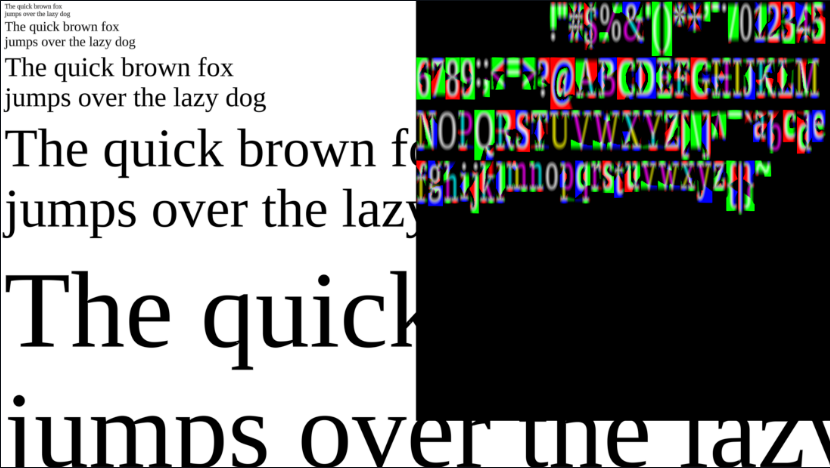

# MSDFGL (OpenGL Font Rendering Library)
MsdfGL is a Font rendering library (https://github.com/nyyManni/msdfgl) which is a OpenGL-accelerated implementation of the multi-channel signed distance-field (MSDF) algorithm. 
This algorithm is used to create sharp rendered characters of a font at any scale. 

## What it does
This library can be used to render custom text to an image and then this rendered text can be displayed for example in OpenGL Application like ours.

Example:

On the right you can see how the font characters are saved with red, green and blue channel.

## Why do we use it
We use this library because of its simplicity and performance. The highly paralellizeable part of the font generation with the MSDF algorithm is paralized with OpenGL on the GPU. The library comes with Generator shader for the heavy lifting which generates the MSDF bitmaps from a given font file. The Render shader can renders crisp text from the generated textures.