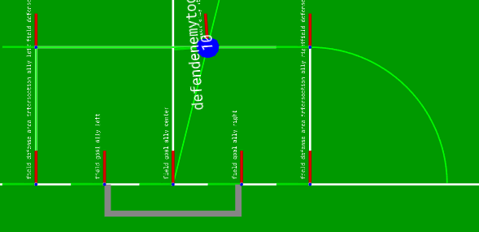

# Examples {#skills_examples}

## Set an `AntiTarget` on every other ally robot:
```cpp
// get list of all possible ally robots
for (const RobotIdentifier& robot : transform::RobotDataStorage::generatePossibleRobots(MAX_ROBOTS_PER_TEAM, Team::ALLY)) {
      drive_step.addFeature(AntiTargetFeature(
      PointShape(robot), 1.0,
      {CALLBACK, [robot](const std::shared_ptr<const transform::WorldModel>& wm, const TaskData& td) -> double {
            // set weight to zero, if the executing robot is the robot of this feature, so the robot does not drive
            // away from itself
            if (robot == td.robot) {
                  return 0.0;
            } else {
                  return 1.0;
            }
            }}));
}
```

## Offset the position of a related robot:
```cpp
//set the position to be always 1m ahead of the first related robot
ComponentPosition offset_position(
      CALLBACK,
      [](const std::shared_ptr<const transform::WorldModel>& wm, const TaskData& td) -> transform::Position {
      return {td.related_robots[0].getFrame(), 1.0, 0.0, 0.0};
      });
```

## Compose Shape and Arc Shape
Define the following composed shape displayed in green (not the line originating form the center of the goal):



Sourcecode:

```cpp
ComposeShape comp_s;
comp_s.addShape(LineShape({transform::field::DEFENSE_AREA_INTERSECTION_ALLY_LEFT},
                            {transform::field::DEFENSE_AREA_CORNER_ALLY_LEFT}));
comp_s.addShape(LineShape({transform::field::DEFENSE_AREA_CORNER_ALLY_RIGHT},
                            {transform::field::DEFENSE_AREA_CORNER_ALLY_LEFT}));
comp_s.addShape(
    ArcShape({{transform::field::DEFENSE_AREA_INTERSECTION_ALLY_RIGHT, 0.0, 0.0, -L_PI / 4}}, 1.0, L_PI / 2));
// add feature to drive step
d1.addFeature(TargetFeature(std::move(comp_s)));
```
