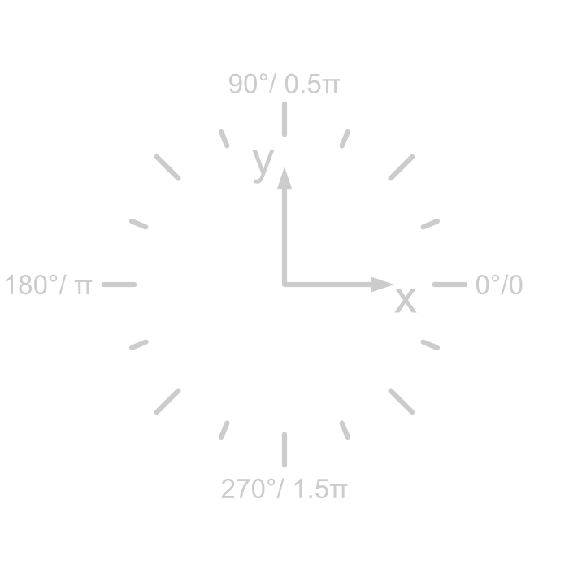

# Terminology {#transform_terminology}
This section explains some vocabulary from mobile robotics so that everyone is on the same level and does not get confused when reading the following sections.
## ``Frames``
A ``Frame`` is used to describe geometric relations. We only use cartesian coordinate frames (short ``Frame``). Unlike in your school class we do not only use one but several `Frames` to describe geometric relations on the field. Furthermore, all `Frames` are two-dimensional as our robots do not have the capability to fly and two-dimensions simplify a lot of things. There is one `global Frame` that is defined in the center of the playing field with the x axis pointing towards the enemy goal. Additionally, every robot has a own `Frame` that represent its positions. Here, the x-axis always point towards the front of the robot. The ball and corners of the field are represented with `Frames` as well. Each frame is identify by a unique string. 

## `Rotation`



The rotation describes the relative angle between two frame. It is defined by the x axis of the frame. Here the rotation is $0°$. The rotation always increases counter clockwise according to the right hand rule (when assuming that the z-axis would point upwards). In our code we use the `Eigen::Rotation2Dd` object to represent rotations in 2D. Unlike for `doubles` several utilities are implemented for `Eigen::Rotation2Dd` objects which are usefull when working with transformations. Here are some examples how to use these objects:

```cpp
//create Rotation
Eigen::Rotation2Dd rotation(/*angle:*/0.5 * L_PI)

//get the rotation as double
double angle = rotation.angle()

//get the corresponding rotation matrix
Eigen::Matrix2d matrix = rotation.matrix();
```

## `Translation`

``Translations`` describe the parallel shift of a child frame in a parent frame. We use the `Eigen::Translation2d` or the `Eigen::Vector2d` object to represent `translations`. These objects can be added and subtracted as well as negated. Here are some examples on how to use `Eigen::Translation2d`:
```cpp
//create translation
Eigen::Translation2d translation = {x,y};

// edit dimension
translation.x() = 3.0;

// access dimension
double y = translation.y();

// add two translations
Eigen::Translation2d translation2 = {x2,y2};
Eigen::Translation2d translation_res = translation + translation2;
```

## `Transform`


A `Transform` is the geometric relation between two ``Frames``. In addition to the translation it includes the relative ``rotation``. A transform has always a ``parent`` and ``child frame``. The transform describes the position and ``rotation`` of the ``child frame`` in the ``parent frame``. Following from that, in two dimensions the ``transform`` includes 3 unique values. Mathematically the `transform` is represented with a 3x3 matrix. You can perform basic arithmetics with it. Like inverting, combining and subtraction. In our code we use the `Eigen::Affine2d` object to represent ``transforms``. Here are some examples on how to use ``transforms``:

Get the ``translation`` from the ``transform``:
``` cpp
Eigen::Affine2d transform;

// get the 2D translation 
Eigen::Translation2d translation = transform.translation();

// get each coordinate separate
double x = translation.x();
double y = translation.y();
```

Get the ``rotation`` from the ``transform``:
```cpp
Eigen::Affine2d transform;
// create a 2D rotation object
Eigen::Rotation2Dd rotation(transform.rotation());

// the angle can only be extracted from the 2D rotation object
double angle = rotation.angle();

// here is a more compact version
double angle = Eigen::Rotation2Dd(transform).angle();
```

Construct a ``transform`` from ``translation`` and ``rotation``:
```cpp
// create translation
Eigen::Translation2d translation = {1.0, 2.0};
//create rotation from radian
Eigen::Rotation2Dd rotation(0.5 * L_PI);

//create transform from translation and rotation
Eigen::Affine2d transform = translation * rotation;
```
> Note that in general ```translation * rotation != rotation * translation```. If the rotation is on the left side the transform gets rotated first and is then moved translational, which can be very unintuitive as the translation is applied in the rotated ``frame``. The proper, most common way is to multiply the rotation from the left side.

## `Velocity`
`Velocities` ar represented with `Eigen::Vector3d`. The first two elements represent the translational velocity in x and y dimension respectively in m/s. The third dimension represents the rotational velocity in rad/s. 

